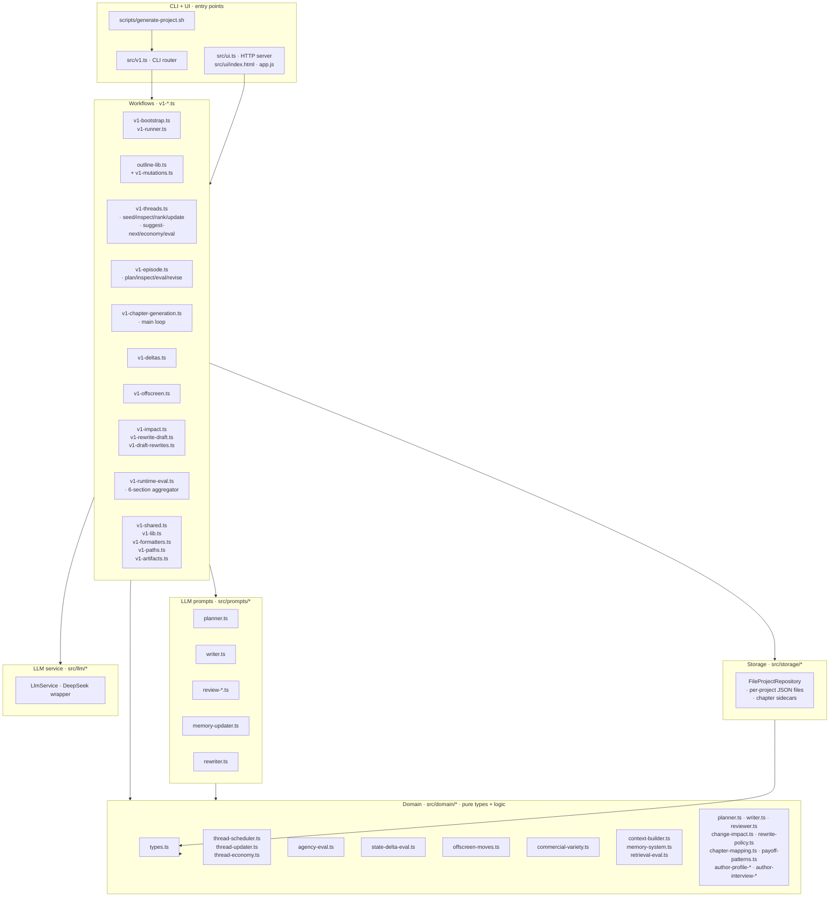
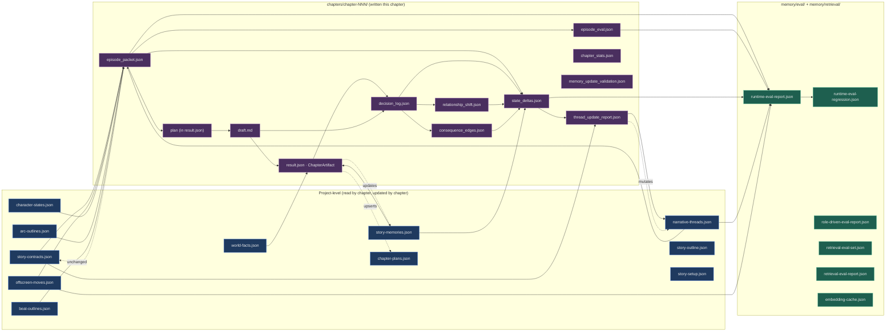
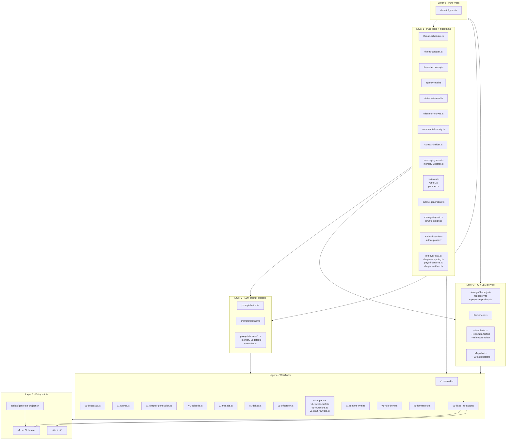
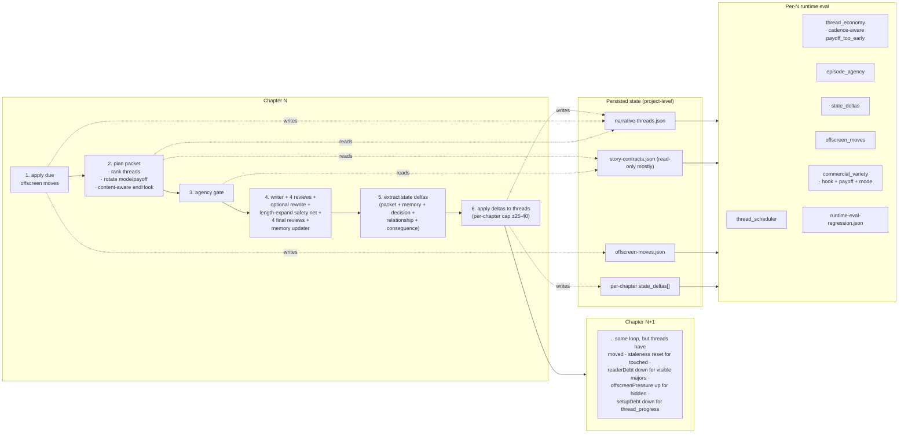
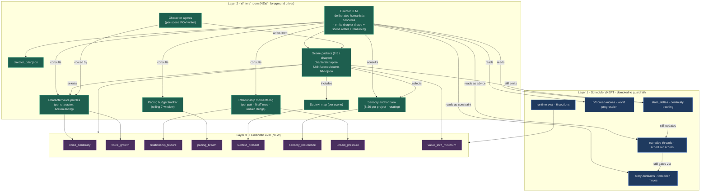

# NovelAi Architecture & Pipeline Diagrams

This document is a navigational map of the engine. Each Mermaid block
renders directly on GitHub. Read the diagrams in the order they appear —
each one zooms in further than the previous.

> 6 diagrams, 1 CLI table:
> 1. System topology (top-down)
> 2. Chapter generation pipeline (per-chapter sequence)
> 3. Per-chapter data artifacts (file flow)
> 4. Module layer dependencies (file map)
> 5. Runtime data loop (cross-chapter state)
> 6. Future humanistic layer overlay
> 7. CLI command map

---

## 1. System Topology

The engine has six concentric layers. CLI/UI on the outside, pure
domain logic on the inside. Each outer layer depends only on the
layers inside it.



**Reading guide:**
- Solid arrows = "imports from" / "calls into."
- Workflows are the only files that touch storage *and* prompts *and*
  domain. They are the integration glue.
- Domain modules are pure: no IO, no LLM calls, no async by default.

---

## 2. Chapter Generation Pipeline (per chapter)

This is the runtime that fires every time a chapter is generated.
Each `↪ LLM` step is a network call to the configured provider.

```mermaid
sequenceDiagram
    autonumber
    participant CLI as CLI / Script
    participant Run as v1-runner.runV1
    participant Gen as generateChapterArtifact
    participant Off as applyOffscreenMovesForChapter
    participant Plan as planEpisodePacket
    participant Eval as evalEpisodePacket (agency gate)
    participant LLM as LlmService
    participant Ctx as buildContextPack
    participant Roles as buildDecisionLog<br/>buildRelationshipShift<br/>buildConsequenceEdges
    participant Repo as FileProjectRepository
    participant Upd as updateThreadsFromChapter

    CLI->>Run: chapter generate-first --count N
    Run->>Run: ensureBootstrappedProject<br/>(skips if already bootstrapped)
    loop for each chapter
        Run->>Gen: generateChapterArtifact(...)
        Gen->>Off: apply due offscreen moves
        Off->>Repo: load offscreen-moves.json
        Off->>Repo: save updated threads + moves
        Gen->>Plan: planEpisodePacket
        Plan->>Repo: load contracts + threads + recent packets
        Plan->>Plan: rankNarrativeThreads<br/>buildEpisodePacketFromRuntime<br/>(mode/payoff rotation)
        Plan->>Repo: save episode_packet.json
        Gen->>Eval: evalEpisodePacket (agency gate)
        Eval-->>Gen: passed=true (else throw)
        Gen->>LLM: ↪ planner (retry-wrapped)
        LLM-->>Gen: ChapterPlan
        Gen->>Ctx: buildContextPack (writer + reviewer)
        Gen->>LLM: ↪ writer
        LLM-->>Gen: draft v1
        par initial review fan-out
            Gen->>LLM: ↪ review_missing_resource
            Gen->>LLM: ↪ review_fact
            Gen->>LLM: ↪ review_commercial
            Gen->>LLM: ↪ review_role_drive (sees prior chapter snapshot)
        end
        Gen->>Gen: buildRewritePlan
        opt rewrite needed
            Gen->>LLM: ↪ rewriter (mode = repair_first / hybrid_upgrade /<br/>commercial_tune / quality_boost)
        end
        opt cn_chars < 2500
            Gen->>LLM: ↪ rewriter (mode = length_expand · safety net)
        end
        par final review fan-out
            Gen->>LLM: ↪ review_missing_resource_final
            Gen->>LLM: ↪ review_fact_final
            Gen->>LLM: ↪ review_commercial_final
            Gen->>LLM: ↪ review_role_drive_final
        end
        Gen->>LLM: ↪ memory_updater (retry-wrapped)
        LLM-->>Gen: memoryPatches + newMemories
        Gen->>Roles: build sidecars (chapter-aware)
        Gen->>Repo: save result.json + draft.md +<br/>episode_packet + episode_eval +<br/>decision_log + relationship_shift +<br/>consequence_edges + chapter_stats +<br/>memory_update_validation
        Gen->>Upd: updateThreadsFromChapter (auto)
        Upd->>Repo: extractStateDeltas<br/>applyDeltasToThreads (capped)
        Upd->>Repo: save state_deltas + narrative-threads +<br/>thread_update_report
        Gen-->>Run: artifact
    end
    Run-->>CLI: V1RunResult
    opt --with-runtime-eval
        CLI->>CLI: runtime eval --chapter N<br/>(6-section aggregator + regression)
    end
```

**Reading guide:**
- Steps `Off` (offscreen apply) and `Upd` (thread update) bracket the
  chapter — pre-pressure goes in, post-pressure goes out.
- The agency gate (step 7) is what blocked chapter 4 in the very first
  run. Now passes because the eval strips quoted context before the
  passive scan.
- The `length_expand` rewrite (step ~12) is the safety net that fired
  on chapter 3 of `demo_run_b` (2213 → 4304 cn chars).
- 10 LLM calls is the typical chapter cost. With one retry on
  `memory_updater` truncation, ~11.

---

## 3. Per-chapter Data Artifacts

Every chapter writes about a dozen artifacts. This is the dataflow
between them.



**Reading guide:**
- **Blue boxes** are project-level (live at `data/projects/<id>/`).
- **Purple boxes** are chapter-level sidecars (live at
  `data/projects/<id>/chapters/chapter-NNN/`).
- **Green boxes** are eval reports.
- Solid arrows = "is read by." Dashed arrows = "writes back to."
- The closed loop `state_deltas → thread_update_report →
  narrative-threads` is what makes chapter N+1's ranking depend on
  what chapter N actually did.

---

## 4. Module Layer Dependencies

How the source files relate to each other.



**Reading guide:**
- Strict layering. Higher layers import from lower; never the reverse.
- Tests live next to the file they test (`*.test.ts`) and only import
  from their own layer or below.
- `v1-lib.ts` is the public face of layer 4 — anything CLI/UI needs
  re-exports from there.

---

## 5. Runtime Data Loop (cross-chapter state)

How threads, contracts, and offscreen moves evolve across multiple
chapters. This is the *deterministic* loop the runtime guarantees.



**Reading guide:**
- Threads are *never* mutated except through `applyDeltasToThreads` or
  `applyDueOffscreenMoves`. Both have audit reports.
- Per-chapter scheduler-delta cap (`±25–40` per field) prevents
  saturation from N parallel deltas in one chapter.
- Cadence-aware `payoff_too_early` rule: exempt for `frequent` /
  `every_chapter`, tighter threshold for `periodic`, standard for
  `slow_burn`.

---

## 6. Future Humanistic Layer Overlay (deferred)

The deferred long-range vision in
`docs/archive/character-driven-narrative-roadmap.md`. The existing
scheduler is preserved as a *guardrail*; a writers'-room layer
becomes the foreground driver. This shift is no longer the active
plan — `docs/sprint-0-task-driven-plan.md` reaches the same goal
via task-driven semi-supervision at lower risk. The diagram below
is kept for context; pieces of it (voice profiles, relationship
moments, sensory anchors) may auto-bootstrap from sprint 0 success.



**Reading guide:**
- **Green** = new humanistic layer (proposed in the roadmap, not yet
  implemented).
- **Blue** = current scheduler engine, preserved as a guardrail.
- **Purple** = new humanistic eval sections that complement the
  existing 6-section runtime eval.
- Roles invert: today's scheduler picks the chapter; in the proposed
  layer the Director picks the chapter and the scheduler only
  surfaces neglect / contracts as advice.
- Toggle via `humanistic_layer: true|false` per project.

---

## 7. CLI Command Map

Currently exposed CLI commands, grouped by concern. Run any of them
through `./run-v1.sh <group> <action> --project <id> [...flags]`.

| Group | Action | Purpose |
|---|---|---|
| `project` | `bootstrap` | Create project + run author interview / preset bootstrap. |
| `project` | `interview` | Interactive interview (alternative to preset). |
| `project` | `profiles` | List author preset catalogue. |
| `project` | `inspect` | Summarise project state. |
| `project` | `paths` | Print all file paths for the project. |
| `project` | `impact` | Change-impact analysis on a target. |
| `project` | `inspect-consequences` | Read role-drive consequence edges. |
| `project` | `rewrite-plan` | Plan a regeneration from a target. |
| `project` | `regenerate-from-target` | Invalidate downstream + regenerate. |
| `project` | `regenerate-with-patches` | Apply patches + regenerate. |
| `project` | `role-eval` | Role-drive eval pass. |
| `memory` | `eval-seed` | Seed retrieval eval set. |
| `memory` | `eval-run` | Run retrieval eval + regression. |
| `story` | `inspect-contracts` | List story contracts. |
| `threads` | `seed` | Bootstrap initial 5-thread runtime + 6 contracts. |
| `threads` | `inspect` | Show contracts + threads + active count. |
| `threads` | `rank` | Rank threads with explanatory reasons + warnings. |
| `threads` | `inspect-deltas` | Read per-chapter state deltas. |
| `threads` | `update-from-chapter` | Apply deltas to threads (auto-fired during chapter generation; can also be invoked manually). |
| `threads` | `economy` | Span-economy report (`thread_overstretched`, `payoff_too_early`, etc.). |
| `threads` | `eval` | Combined economy + scheduler eval. |
| `threads` | `suggest-next` | Local steering: propose next chapter's primary + supporting moves. |
| `episode` | `plan` | Build episode packet for a chapter. |
| `episode` | `inspect` | Read episode packet. |
| `episode` | `eval` | Agency eval. |
| `episode` | `revise-packet` | Snapshot + regenerate the packet (local steering). |
| `offscreen` | `schedule` | Seed offscreen moves from cast roles. |
| `offscreen` | `inspect` | Inspect moves + run eval. |
| `offscreen` | `apply` | Apply due moves to threads (auto-fired during chapter generation). |
| `runtime` | `eval` | 6-section runtime eval + regression diff (`--strict-eval` blocks). |
| `outline` | `inspect` | Inspect story+arc+beat outlines. |
| `outline` | `suggest-patches` | Role-drive patch suggestions. |
| `outline` | `apply-patches` | Apply outline patches. |
| `outline` | `generate-stack` | Generate story+arc+beat outlines (LLM). |
| `outline` | `generate-drafts` | Render `detailed-outline.md` for human review. |
| `outline` | `approve-detail` | Mark detailed outline approved (gates chapter gen). |
| `outline` | `validate` | Outline validation. |
| `chapter` | `generate` | Generate one chapter end-to-end (LLM). |
| `chapter` | `generate-first` | Generate the first N chapters (LLM). |
| `chapter` | `inspect` | Read a generated chapter. |
| `chapter` | `rewrite` | Rewrite a chapter (full regen). |
| `chapter` | `rewrite-draft` | Rewrite just the draft (keep plan + reviews). |
| `chapter` | `apply-draft-rewrite` | Promote a draft rewrite to canonical. |
| `chapter` | `list-draft-rewrites` | List draft-rewrite versions. |
| `chapter` | `inspect-draft-rewrite` | Read one rewrite version. |
| `chapter` | `invalidate-from` | Delete chapters from N onward. |
| `chapter` | `invalidate-target` | Delete chapters affected by a target. |
| `chapter` | `reset-all` | Wipe all chapters. |

The shell wrapper `scripts/generate-project.sh` chains the bootstrap →
outline → approve → threads-seed → optional offscreen-schedule →
chapter-generate-first → optional runtime-eval steps with idempotent
skipping.

---

## Cross-references

- Phase-by-phase build order: `docs/longform-narrative-engine-todolist.md`
- Original engine vision: `docs/longform-narrative-engine-roadmap.md`
- Current next-sprint plan (task-driven semi-supervision):
  `docs/sprint-0-task-driven-plan.md`
- Future humanistic layer (deferred):
  `docs/archive/character-driven-narrative-roadmap.md`
- Archived sprint 1 plan (superseded by sprint 0):
  `docs/archive/sprint-1-humanistic-plan.md`
- Archived earlier docs: `docs/archive/`
